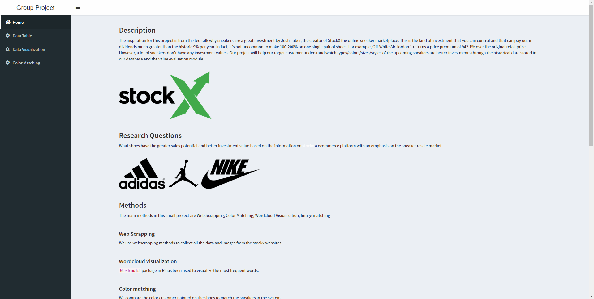
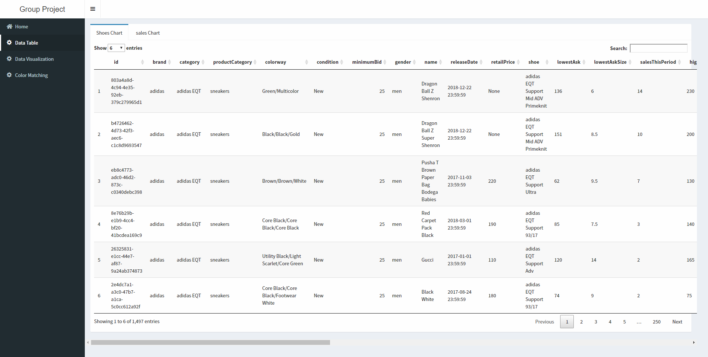
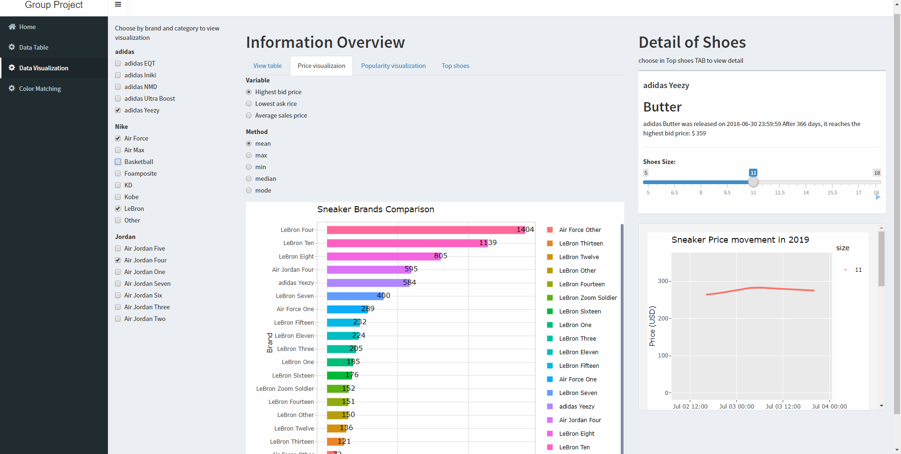
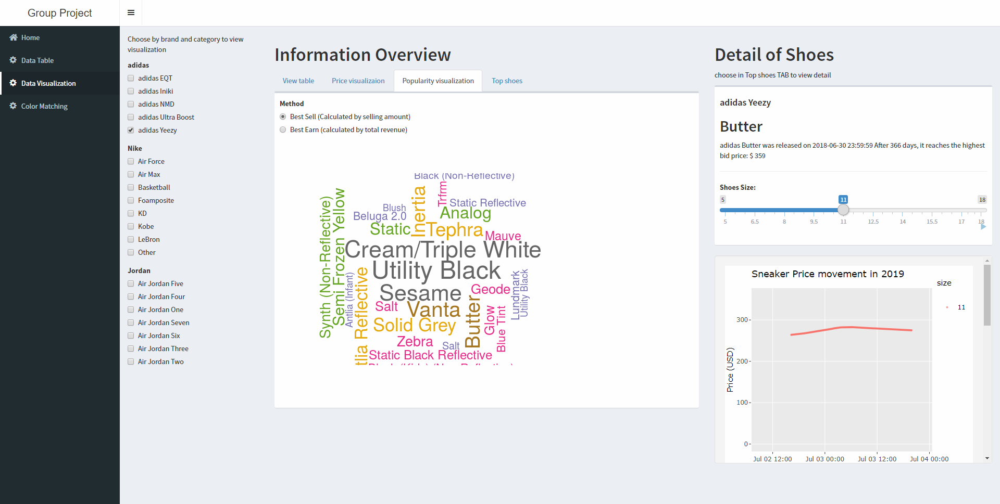
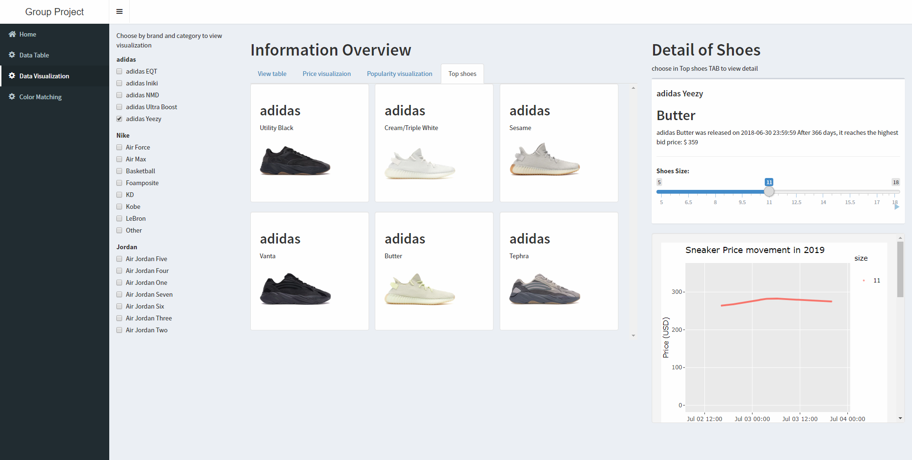
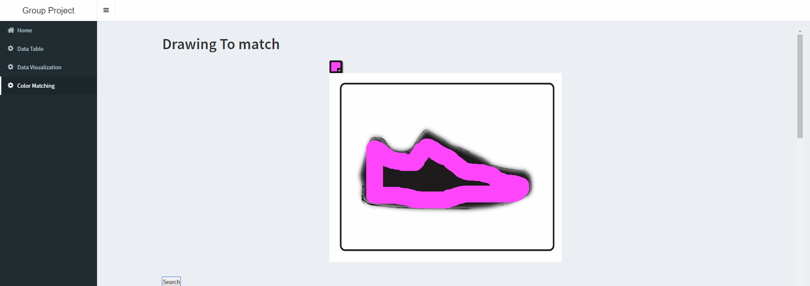
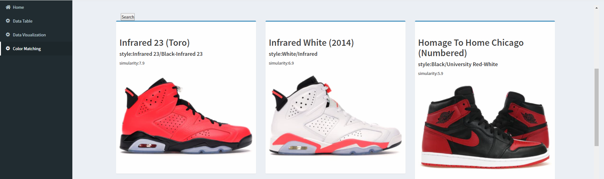

# Sneaker visualization and recommendation
*A data visualization and color-matching recommendation website for sneakers based on R Shiny*

  
A website is made with R Shiny App to analyze and visualize the data of sneaker sellings. The website is published using r shiny app. LINK:[https://datafromstockx.shinyapps.io](https://datafromstockx.shinyapps.io).
  
The data used is collected from StockX.com with Python. Main part of the code is attached to google colab [link](https://colab.research.google.com/drive/1X7_NjXMkxWrZ7Vsg5v1mqoLNozjMCpuy). The same file can be seen as stockx_data.ipynb.
  
Main code of data preprocessing is included as stockx_pre.Rmd. Clean data can also be seen from csv files in www/csv.
## Features

### Description page

### Data overview page

### Visualization page

### Draw to match page

  
## Contribution
This is a group project for a course. My teammate Wendy, Sean and I worked together to accomplish this work.  
